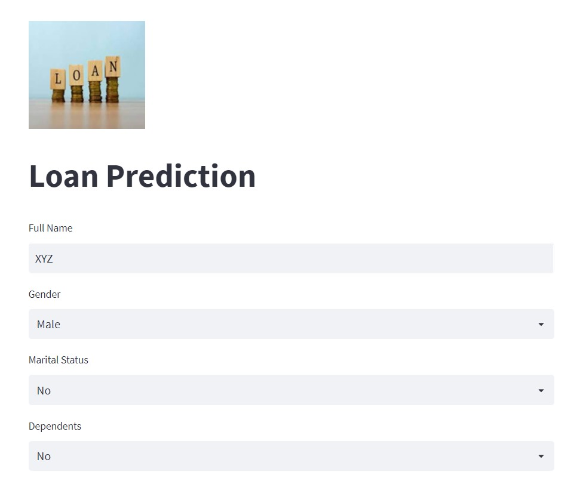
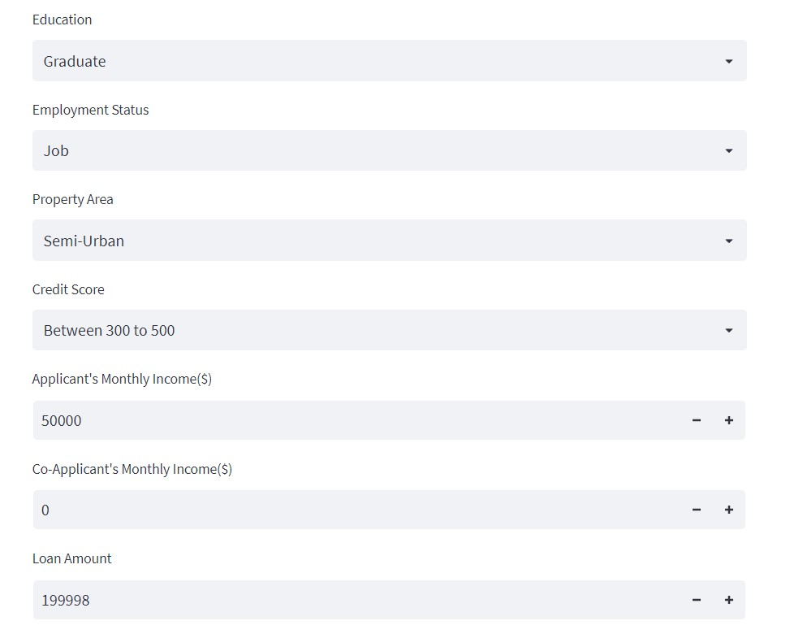
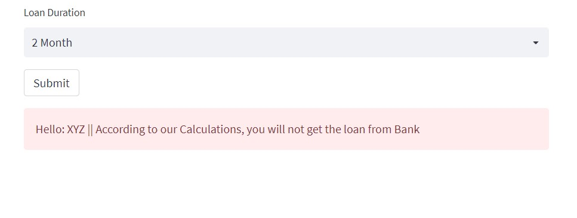

# Loan-Prediction
Streamlit website to check Loan approval of user using ML algorithm

Steps to create the project-
1. Clone the repository. 
2. Run the following command.
  	  1. pip install -r requirements.txt
3. LoanPrediction.py is the main Python file of the Streamlit App.
4. To run the app, write the following command in Terminal.
      1. streamlit run LoanPrediction.py
    
Model.ipynb is the notebook file of the Data pre-processing & Machine Learning.
Dataset folder contains the train and test CSV files of this project.

Screenshots of Web App:

